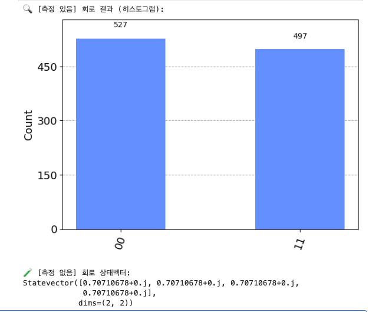
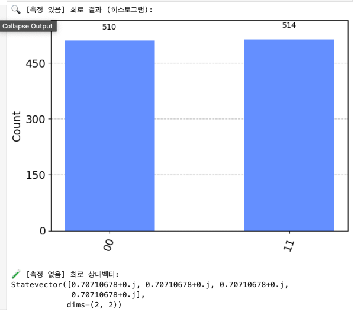
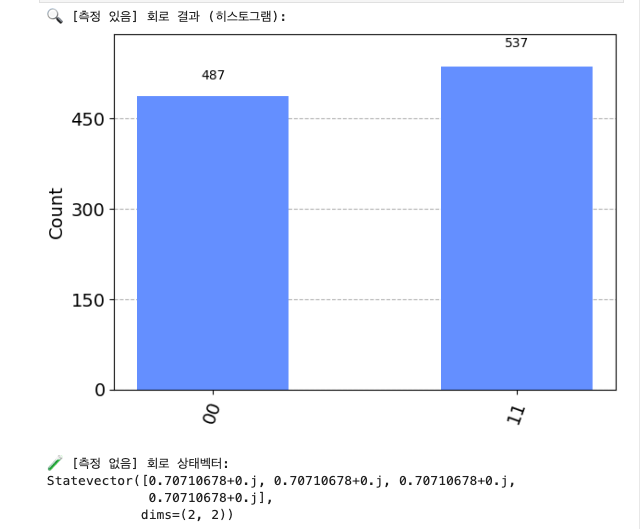

# 실험군 G-A: 관측 유무에 따른 구조 유지 여부 실험  
# Experiment Group G-A: Structural Stability Under Observation vs Non-Observation

## 실험 목적  
## Objective
양자 회로 내에서 "관측"이 단순한 정보 추출이 아닌, 구조 선택 및 유지에 기여하는지를 검증한다. 특히, 동일한 얽힘 상태에서 관측 유무에 따라 최종 결과 분포와 상태벡터의 차이를 관찰함으로써, 구조가 관측 이전에도 존재했는지를 실험적으로 밝힌다.  
This experiment verifies whether quantum measurement contributes not only to information extraction but also to structural selection and maintenance. Specifically, it compares outcome distributions and statevectors with and without observation, to test whether structure exists prior to measurement.

---

## 실험 회로 설계  
## Circuit Design

- **회로 구성**: 2 큐빗 얽힘 회로  
  **Circuit**: 2-qubit entanglement
  - 게이트: H(0) → CX(0, 1)  
    Gates: H(0) → CX(0, 1)
  - 얽힘 상태: \(|\psi\rangle = \frac{1}{\sqrt{2}}(|00\rangle + |11\rangle)\)  
    Target entangled state: \(|\psi\rangle = \frac{1}{\sqrt{2}}(|00\rangle + |11\rangle)\)

- **분기 조건**:  
  **Branching Conditions:**
  - **실험군**: 얽힘 후 측정 포함 (관측 있음)  
    Experimental group: Measurement applied after entanglement (observation)
  - **대조군**: 얽힘 후 측정 없음, 상태벡터 추출  
    Control group: No measurement, extract statevector after entanglement

---

## 실행 환경  
## Execution Environment
- Qiskit 1.0.2
- Aer Simulator (`aer_simulator`)
- Shots: 1024 (측정 회로)  
  Shots: 1024 (for measurement circuit)

---

## 결과 요약  
## Summary of Results

### 1. 측정 있음 (관측)  
### 1. With Measurement (Observation)
다음은 세 번의 독립 실행에서 측정 결과를 시각화한 히스토그램이다.  
Below are histograms from three independent executions.

#### 실행 1  
#### Run 1

- `|00⟩`: 527
- `|11⟩`: 497
- `|01⟩`, `|10⟩`: 없음  
  `|01⟩`, `|10⟩`: None

#### 실행 2  
#### Run 2

- `|00⟩`: 487
- `|11⟩`: 537
- `|01⟩`, `|10⟩`: 없음

#### 실행 3  
#### Run 3

- `|00⟩`: 510
- `|11⟩`: 514
- `|01⟩`, `|10⟩`: 없음

> 모든 실험에서 `|00⟩`과 `|11⟩`만 관측되었으며, 이는 회로가 허용한 구조적 선택지 외에는 결과가 나타나지 않았음을 의미한다.  
> Only `|00⟩` and `|11⟩` were observed in all experiments, indicating that outcomes are constrained to structural choices defined by the circuit.

---

### 2. 측정 없음 (비관측)  
### 2. Without Measurement (Non-Observation)
모든 반복에서 상태벡터는 다음과 같았다:  
In all repeated runs, the statevector was:

```python
Statevector([0.7071+0.j, 0.7071+0.j, 0.7071+0.j, 0.7071+0.j], dims=(2, 2))
```

> 이는 `|00⟩`, `|01⟩`, `|10⟩`, `|11⟩` 전부에 균등하게 분포된 상태이며, 관측이 없을 경우 구조가 고정되지 않고 열린 상태로 유지됨을 의미한다.  
> This represents a uniform superposition over all four basis states. Without observation, the structure remains open and undecided.

---

## 구조적 해석  
## Structural Interpretation

- 측정이 있으면 회로는 `|00⟩` 또는 `|11⟩` 중 하나로 붕괴하며, 이는 **회로 내부에 존재하는 구조적 선택지**가 **관측에 의해 선택되는 과정**이다.  
  With measurement, the circuit collapses to `|00⟩` or `|11⟩`, showing that measurement selects among predefined structural options inherent to the circuit.

- 측정이 없으면 상태는 열린 구조로 유지되며, **관측이 구조 선택을 유도하고, 가능성의 공간을 결정한다**는 점이 명확히 드러난다.  
  Without measurement, the state remains open. Measurement triggers structural selection and limits the space of possible outcomes.

### 결론  
### Conclusion
> 관측은 상태를 무작위로 선택하지만, **선택지는 회로 구조에 의해 제한**된다.  
> Measurement randomly selects an outcome, but the options themselves are pre-defined by the circuit structure.  
> 따라서, 실험 결과는 관측 이전에도 회로에 구조가 존재했음을 간접적으로 증명한다.  
> Thus, the experiment indirectly demonstrates that structural constraints exist prior to observation.

---

## 후속 실험 계획  
## Follow-up Experiment
G-B 실험에서는 동일 구조에서 관측을 반복 적용하며, 그 결과 구조가 얼마나 안정적으로 재현되는지를 관찰함으로써 관측-구조 간 피드백 관계를 실험할 예정이다.  
In the G-B experiment, repeated observation will be applied to the same circuit to investigate how consistently the structure is reproduced, revealing potential feedback dynamics between observation and structure.

