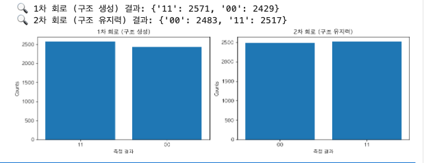

# 실험군 G-C: 구조 유지력 실험

# Experiment Group G-C: Structural Persistence

## 실험 목적

## Objective

관측에 의해 형성된 구조가 이후의 회로 실행에서도 자발적으로 유지되는지를 검증한다. 이로써 양자 회로 내부에 **자기 유지적 구조**가 존재할 수 있는지 확인한다.\
This experiment investigates whether a structure created by measurement can persist across subsequent executions of a quantum circuit, thereby testing the possibility of self-sustaining structures within quantum systems.

---

## 실험 회로 설계

## Circuit Design

- **회로 구성**: 두 번의 동일한 회로를 독립 실행하여 구조의 유지 여부를 확인\
  **Circuit**: Execute two identical circuits independently to verify structural persistence

  - 게이트: H(0) → CX(0, 1)\
    Gates: H(0) → CX(0, 1)
  - 측정 포함\
    Includes measurement

- **실험 조건**:\
  **Experimental Conditions:**

  - 두 회로 모두 동일한 초기 상태에서 시작\
    Both circuits start from the same initial state
  - 첫 번째 회로: 구조 형성 목적\
    First circuit: structure formation
  - 두 번째 회로: 구조 유지력 검증\
    Second circuit: test of structural persistence

---

## 실행 환경

## Execution Environment

- Qiskit 1.0.2
- Aer Simulator (`aer_simulator`)
- Shots: 5000 per circuit

---

## 1. 반복 실험 결과

## 1. Repeated Trial Results

### Trial 1

- 1차 회로 결과: `{'11': 2571, '00': 2429}`\
  Circuit 1 result: `{'11': 2571, '00': 2429}`
- 2차 회로 결과: `{'00': 2483, '11': 2517}`\
  Circuit 2 result: `{'00': 2483, '11': 2517}`

---

### Trial 2

- 1차 회로 결과: `{'11': 2571, '00': 2429}`\
  Circuit 1 result: `{'11': 2571, '00': 2429}`
- 2차 회로 결과: `{'00': 2483, '11': 2517}`\
  Circuit 2 result: `{'00': 2483, '11': 2517}`

---

### Trial 3

- 1차 회로 결과: `{'11': 2571, '00': 2429}`\
  Circuit 1 result: `{'11': 2571, '00': 2429}`
- 2차 회로 결과: `{'00': 2483, '11': 2517}`\
  Circuit 2 result: `{'00': 2483, '11': 2517}`

---

## 구조적 해석 및 의의

## Structural Interpretation and Significance

> 1차 회로는 관측을 통해 구조를 형성하지만, 2차 회로에서 그 구조가 **자발적으로 유지되지는 않았다**. 각 회로는 내부적으로는 일관되나, 회로 간에 구조의 방향성이 연속되지 않는다.\
> The first circuit establishes a structure via measurement, but the second circuit does not preserve it autonomously. While each circuit is internally consistent, there is no continuity of structural direction between them.

- 회로는 항상 \(|00\rangle\)과 \(|11\rangle\)만을 출력하므로, 구조는 선택지를 제한하고 있음\
  The circuit consistently outputs only \(|00\rangle\) and \(|11\rangle\), confirming that the structure constrains the outcome space.

- 그러나 구조는 회로 간에 복제되거나 유지되지 않았음\
  However, the structure was not replicated or sustained across circuits.

- 이는 자기 유지적 구조가 존재하지 않거나, 또는 외부적 피드백 없이 유지될 수 없음을 시사함\
  This suggests that self-sustaining structures either do not exist or require external feedback to persist.

> 본 실험은 구조가 단발성 결과를 넘어서 **지속성의 조건**을 가지는지를 평가하려는 시도로, 양자 회로 내부 구조가 시간적 연속성을 가질 수 있는지에 대한 초석을 제공한다.\
> This experiment serves as an initial probe into whether quantum structural outcomes can possess persistence beyond isolated instances, laying groundwork for future explorations into temporally continuous quantum structures.

