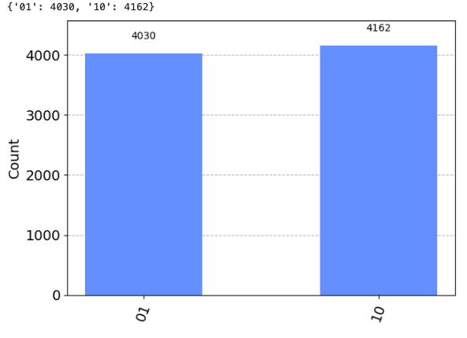

# 실행군 G-E: 구조 선택 실험

# Experiment Group G-E: Structural Selection Experiment

## 실행 목적

## Objective

회로 내부에서 조건에 따라 구조가 자발적으로 선택될 수 있는지를 실험한다. 구조가 외부로부터 주어지는 것이 아니라, 회로 내부 조건에 따라 분기적으로 선택될 수 있다면, 이는 구조적 자율성의 존재를 뒷받침할 수 있다.\
This experiment tests whether a quantum circuit can autonomously select between internal structural configurations based on its internal conditions. If the circuit chooses a structure based on internal states rather than external enforcement, it suggests the presence of structural autonomy.

---

## 실행 회로 설계

## Circuit Design

- **회로 구성**: 분기 조건(q[0])을 기반으로 구조 A와 구조 B 중 하나를 선택 실행\
  **Circuit**: Use a branching condition (q[0]) to selectively execute either structure A or structure B

  - q[0] → H gate로 확률적 분기 생성\
    q[0] → H gate to induce probabilistic branching
  - 구조 A: q[0]=0일 때만 CX(q[0], q[1]) 실행\
    Structure A: CX(q[0], q[1]) executed only when q[0]=0
  - 구조 B: q[0]=1일 때만 CX(q[0], q[2]) 실행\
    Structure B: CX(q[0], q[2]) executed only when q[0]=1

  ```
  qc.h(0)
  qc.x(0)
  qc.cx(0, 1)
  qc.x(0)
  qc.cx(0, 2)
  qc.measure(1, 0)
  qc.measure(2, 1)
  ```

- 각 실행에서 하나의 구조만 활성화됨 (중첩 또는 동시 실행 없음)\
  Only one structure is active per execution (no superposition or overlap)

---

## 실행 조건

## Experimental Conditions

- Qiskit 1.0.2
- Aer Simulator (`AerSimulator()` from `qiskit_aer`)
- Shots: 8192

---

## 실행 결과

## Execution Result

- Result: `{ '10': 4162, '01': 4030 }`



- 분포 차이 약 1.6% 이내, 통계적으로 유의미하지 않음\
  Difference between outcomes is within 1.6%, statistically insignificant

- `00`, `11`은 나타나지 않음\
  Neither `00` nor `11` occurred

---

## 구조적 해석 및 의의

## Structural Interpretation and Significance

> 회로가 내부 분기 조건에 따라 구조 A 또는 구조 B 중 하나를 선택 실행하였다. 실행마다 구조는 독립적으로 하나만 활성화되었으며, 중첩 실행은 발생하지 않았다.\
> The circuit selected and executed either structure A or structure B based on internal branching conditions. Each execution activated only one structure with no overlapping behavior.

- `10` → 구조 A 선택됨 (q[1]=1, q[2]=0)\
  `10` → Structure A selected (q[1]=1, q[2]=0)
- `01` → 구조 B 선택됨 (q[1]=0, q[2]=1)\
  `01` → Structure B selected (q[1]=0, q[2]=1)

- 결과 분포는 확률적으로 균형되어 있음\
  Output distribution is statistically balanced
- 회로에 의한 구조 선택이 외부 개입 없이 작동함을 확인\
  Confirms that structural selection is autonomously governed by the circuit

> 이는 구조가 고정된 것이 아니라, 조건에 따라 회로가 구조를 선택하고 있다는 명확한 증거다.\
> This provides clear evidence that the circuit is not statically configured, but dynamically selects structures based on internal states.

