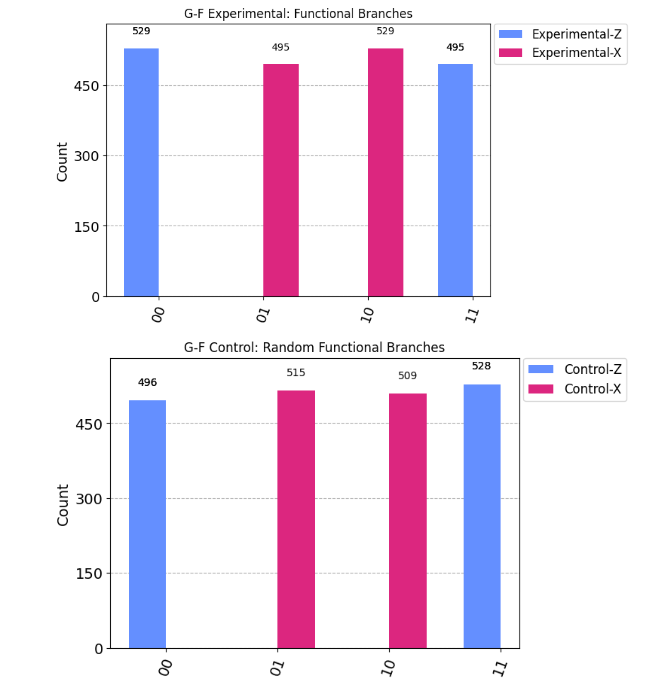

# 실험군 G-F: 구조 기능 진화 실험

# Experiment Group G-F: Structural Function Evolution

## 실험 목적

## Objective

관측과 선택 이후, 구조가 단순히 반복 재현되는 것에 그치지 않고 **새로운 기능 또는 방향성을 획득하는가**를 검증한다. 구조가 고정된 목적을 향해 고착되거나, 반대로 기능적 분화를 겪으며 진화할 수 있는지를 관찰한다. 이 실험은 구조 선택 이후의 **기능적 자기변형 가능성**을 실험한다.
This experiment examines whether a structure, once selected through observation, merely persists as-is or acquires new functions or directions. It aims to determine if structures become fixed toward a predefined purpose or undergo functional differentiation. This explores the possibility of **functional self-modification** after structural selection.

---

## 실험 회로 설계

## Circuit Design

- **회로 구성**: 관측에 의해 선택된 구조를 기반으로 두 가지 상이한 기능적 분기를 설계한다. 이후 회로에서 두 기능 중 어느 쪽이 더 높은 빈도로 선택되는지를 측정함으로써 구조의 기능적 방향성을 관찰한다.  \
**Circuit**: Based on the structure selected through observation, design two diverging functional paths. In subsequent executions, measure which functional path is more frequently taken to determine the structural directionality.

  - 예시 회로 흐름: `H(0) → CX(0,1) → 관측 → 조건부 분기 (Z 또는 X 기반 회로)`  \
    Example circuit: `H(0) → CX(0,1) → measurement → conditional branching (Z-basis or X-basis circuit)`

  - 선택된 구조를 기반으로 한 조건부 분기 설계 필요  \
    Conditional branching must depend on previously selected structure

  - 각 회로 분기의 기능적 특성은 명확히 구분되도록 설계 (예: GHZ vs Bell 상태 생성 등)  \
    Functional characteristics of each branch must be clearly distinct (e.g., GHZ vs Bell state generation)

- **대조 회로 구성**: 동일한 입력 및 초기 상태를 가지되, 구조 선택 과정을 생략하거나 무작위 선택으로 대체하여 결과 분포의 차이를 비교한다.  \
**Control Circuit**: Use the same input and initial state, but omit the structural selection process or replace it with random choice to compare outcome distributions.

  - 예시: `H(0) → CX(0,1) → 무조건 분기 또는 균등 분기`  \
    Example: `H(0) → CX(0,1) → unconditional or uniformly random branching`

  - 목적: 구조 선택이 기능 분기 선택에 미치는 영향을 구분해내기 위함  \
    Purpose: To isolate the influence of structural selection on functional path bias

---

## 관측 및 분석

## Observation & Analysis

- 동일 초기 상태에서 여러 번 실행하여 구조 선택 이후 어느 기능이 반복적으로 유지되는지 확인  \
  Run the circuit multiple times from the same initial state to verify which function is repeatedly favored after structural selection

- 기능적 경로의 확률적 비중이 특정 방향으로 수렴하는지를 분석  \
  Analyze whether the probabilities of functional paths converge toward a specific direction

- 구조 선택이 단순 반복에 머무르지 않고, 기능적 진화를 동반하는지 평가  \
  Evaluate whether structural selection leads to functional evolution, not mere repetition

- **대조 회로와의 결과 비교를 통해** 구조 선택 유무가 경로 선택에 영향을 주었는지를 판별한다.  \
  Use the comparison with control circuits to determine whether structural selection influenced functional outcomes.

---

## 예상 결과

## Expected Results

- **기능 경로가 하나로 수렴된다면**:  \
  이는 구조가 기능적 방향성을 획득했음을 시사할 수 있지만, 단순한 경로의 우세나 회로 설계의 비대칭 가능성도 배제할 수 없다. 대조 회로와의 비교가 필요하다.  \
  If one functional path is repeatedly selected, it may suggest acquisition of functional directionality, but could also result from path bias or circuit asymmetry. Comparison with a control circuit is necessary.

- **기능 경로가 무작위로 유지된다면**:  \
  현재 회로 설계에서는, 관측 이후 선택된 구조가 기능 분기 결과에 뚜렷한 영향을 주는 경향이 확인되지 않았다. 이는 구조-기능 간 인과성이 부재함을 뜻한다기보다, 그러한 인과가 드러나기에 충분한 구조적 대비 또는 기능 분화 설계가 아직 미비했을 가능성이 크다.  \
  In the current circuit design, no distinct influence of the post-observation structure on functional branching was detected. This does not imply the absence of a structure-function relationship, but rather suggests that the design lacks sufficient structural contrast or functional divergence to reveal such a relationship.

- **기능 경로가 실행 횟수에 따라 점진적으로 수렴한다면**:  \
  자기강화 또는 피드백 루프의 존재를 암시하지만, 이는 구조적 진화인지 회로의 내재적 편향인지를 검증할 추가 실험이 필요하다.  \
  If convergence toward one path occurs over time, it may indicate self-reinforcement or feedback mechanisms, but further experiments are needed to distinguish this from intrinsic bias.

---

## 추가 고려 사항

## Additional Considerations

- 이 실험은 구조가 외부 개입 없이도 **기능적 선택을 자기 내부에서 재구성할 수 있는가**를 가늠한다.  \
  This experiment assesses whether a structure can **internally reconfigure its functional choices** without external intervention.

- 실험 설계 상 선택지를 의도적으로 분리하되, **회로의 입력 조건은 동일하게 유지**해야 한다.  \
  Ensure that while functional options are clearly separated, **initial input conditions remain identical**.

- 대조 회로를 반드시 포함하고, **실험 회로와 동일 조건에서 비교 분석**할 수 있도록 구성한다.  \
  Include a control circuit and ensure that it is comparable under identical conditions to the experimental circuit.

---

## 실험 결과 요약

## Experimental Result Summary

관측 기반 실험 회로(`Experimental-Z`, `Experimental-X`)와 무작위 분기 대조 회로(`Control-Z`, `Control-X`)를 각각 독립적으로 실행한 결과, 다음과 같은 히스토그램 분포를 얻었다:  \
Observation-based experimental circuits (`Experimental-Z`, `Experimental-X`) and randomly branched control circuits (`Control-Z`, `Control-X`) were independently executed. The following histogram distributions were obtained:

분석 결과, 각 기능 경로(Z 또는 X)에 따라 생성된 출력 상태(00, 01, 10, 11)의 분포는 실험군과 대조군 모두에서 뚜렷한 차이를 보이지 않았다. 기능 분기 이후 결과는 통계적으로 유사했으며, 이는 다음을 의미한다:  \
Analysis revealed no clear differences between experimental and control groups in the output distributions (00, 01, 10, 11) generated along functional paths Z and X. The functional outcomes after branching were statistically similar, which implies:

- 현재 회로 설계에서는, 관측 이후 선택된 구조가 기능 분기 결과에 뚜렷한 영향을 주는 경향이 확인되지 않았다.  \
  In the current circuit configuration, no distinct influence of the selected structure after observation on functional branching was confirmed.
- 이는 구조-기능 간 인과성이 부재함을 뜻한다기보다, 그러한 인과가 드러나기에 충분한 구조적 대비 또는 기능 분화 설계가 아직 미비했을 가능성이 크다.  \
  This does not imply an absence of structure-function causality, but rather suggests that the circuit lacks sufficient structural contrast or functional differentiation to reveal such causality.
- 관측 구조가 기능을 형성하는지 여부는, 기능 경로 간 분명한 차별성과 구조의 반응성 확보 이후에 보다 명확히 검증될 수 있다.  \
  Whether the observed structure gives rise to functional formation can be more clearly validated after securing sharper distinctions between functional paths and ensuring structural responsiveness.

후속 실험에서는 기능 경로 간 차이를 더 뚜렷하게 설정하거나, 반복 실행에 따른 경향 분석이 필요할 수 있다.  \
Future experiments may require clearer functional divergence between branches or trend analysis across repeated executions.

